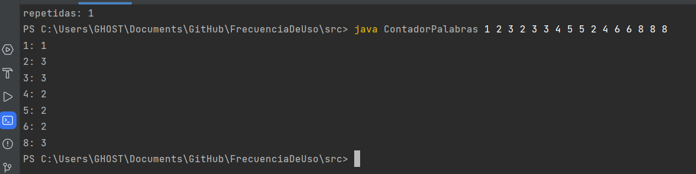
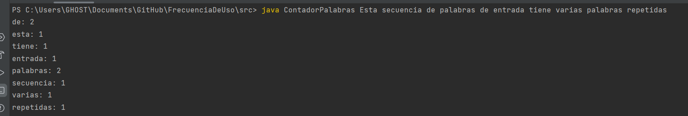
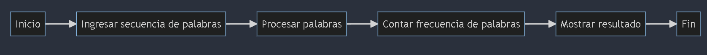

# Contador de Frecuencia de Palabras

Este programa en Java te permite contar la frecuencia de cada palabra en una secuencia de entrada.


**SDK** corretto 19


## Uso

1. **Compilación**: Abre una terminal y navega al directorio donde se encuentra el archivo `ContadorPalabras.java`:

   ```bash
   cd C:\Users\GHOST\Documents\GitHub\FrecuenciaDeUso\src

2. Luego, compila el archivo usando el comando javac:

   ```bash
    javac ContadorPalabras.java

3. **Ejecución**: Aún en la misma terminal y directorio, ejecuta el programa proporcionando la secuencia de palabras como argumentos:
El programa mostrará la frecuencia de cada palabra en la secuencia.

## ejemplos de ejecucion:




## diagrama:


codigo mermaid:

      flowchart LR
      A[Inicio] --> B[Ingresar secuencia de palabras]
      B --> C[Procesar palabras]
      C --> D[Contar frecuencia de palabras]
      D --> E[Mostrar resultado]
      E --> F[Fin]


CARLOS G.